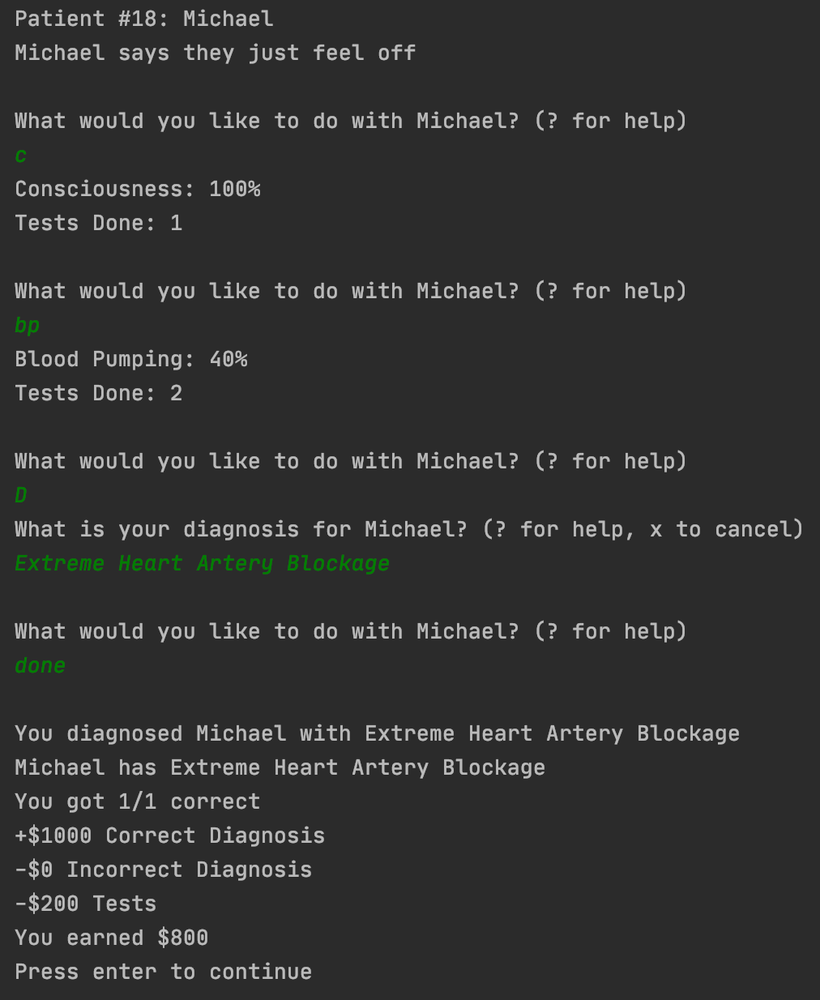

# TextMedical

This game lets you test patients for various symptoms and diagnose them accordingly. Information from [this database](https://docs.google.com/spreadsheets/d/1eAPHsrtHAlt3U7l0Tco7dgFO1FPGdvOigj2jy1CFRMo/edit?usp=sharing) is required to play.

## Commands
| Command | Action |
| ------- | ------ |
| P | Test pain |
| C | Test consciousness |
| S | Test sight |
| H | Test hearing |
| MOV | Test moving |
| MAN | Test manipulation |
| T | Test talking |
| BR | Test breathing |
| BF | Test blood filtration |
| BP | Test blood pumping |
| MET | Test metabolism |
| V | Ask if vomiting (Doesn't count as test) |
| D | Diagnose |
| DONE | Finish |
